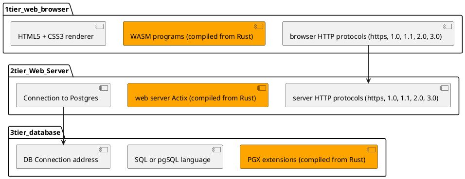

[comment]: # (auto_md_to_doc_comments segment start A)

# database_web_ui_on_server

[comment]: # (auto_cargo_toml_to_md start)

**07. Tutorial for Coding a database Web UI in Rust (2022-08)**  
***version: 0.0.47 date: 2022-08-28 author: [bestia.dev](https://bestia.dev) repository: [Github](https://github.com/bestia-dev/database_web_ui_on_server)***  

[comment]: # (auto_cargo_toml_to_md end)

[comment]: # (auto_lines_of_code start)

[comment]: # (auto_lines_of_code end)

  

Hashtags: #rust #rustlang #tutorial  
My projects on Github are more like a tutorial than a finished product: [bestia-dev tutorials](https://github.com/bestia-dev/tutorials_rust_wasm).

## Intro

This is the 7th part of the [Rust tutorial series](https://www.youtube.com/channel/UCitt3zFHK2jDetDh6ezI05A). Today we will code a "Web-app processed on the web server for CRUD database operations". We will use the Rust development environment inside a container and the knowledge we developed in this tutorial series.  

This project has also a youtube video tutorial. Watch it:
<!-- markdownlint-disable MD033 -->

<!-- markdownlint-enable MD033 -->

## Motivation

Most of the software solutions do just simple things: saving, transforming and reading data.  
This is typically the work of an SQL database server.  
The big job for us developers is to represent this data in a friendly way for the final user.  
The problem is pretty simple, but the separation of the architecture into 3 different tiers, with different technologies and languages, makes it difficult to start.  
I'd like to make a simple scaffolding example to enable a quick start of the development for similar applications.  
I'd like to use Rust as much as possible.  

## Cross-platform, internet, cloud, architecture

We can use the internet standards to assure that our application is cross-platform. It will work as long as a modern browser works on the machine.

We want to separate the application in 3 tiers, to allow for great installation flexibility.  
Three-tier architecture is a well-established software application architecture that organizes applications into three logical and physical computing tiers:

1. the presentation tier, or user interface
2. the application tier, where data is processed
3. the data tier, where the data is stored and managed

The same application could then work everywhere:

1. on a single machine
2. on separate machines in the local network
3. on a cluster of machines in the cloud

## Database

For most real life problems the performance and flexibility of the SQL server is fantastic. Just in rare cases of very big-data collections the performance of the SQL server is not enough and we must go into the non-SQL territory. But then we loose all the magnificent flexibility and simplicity of the SQL and relational database (RDB).  
I like to use the open-source Postgres sql server.  
The 4 operations on the data are called CRUD (create, read, update and delete). It does not look complicated.  
The SQL language is also extra simple. It uses just a few simple and understandable english words and a simple syntax.  
We can read the data with the SELECT statement. We can JOIN related tables and we can filter the data with WHERE. Finally we can ORDER the data.  
SQL statements are usually just a string and the first instinct is to just concatenate it.  
Wrong !!!  
If you mix commands and data like in the SQL statement, there is the possibility of an SQL injection! If a malicious player writes commands instead of data, the server will run it and chaos will win. So we need to enforce true parameters. There must be no way how to introduce a SQL injection attack.  

For complicated SELECT statement I prefer to create VIEWs inside the database server. Then this can be used from multiple places.  

For INSERT, UPDATE and DELETE I like to write sql functions that change data.  Often, we need to check some other data before or after we change some data. Sql functions live very near to where the data is stored so I expect best performance.  

## Web server and web app

Basically all the data manipulation and retrieval is coded inside the database with views and sql functions. Our web server just need to transform this data into a user friendly interface. There is not much specific code we need in this Rust code. It is mostly generic. Just transformation between database and user interface.  

For this tutorial I will manipulate the HTML code on the server, just like in the good-old times. In the next tutorial we will manipulate the data on the client like kids do it today.  

## Browser, HTML5, CSS3, Wasm

The graphical user interface is rendered inside the web browser.  
The web standards HTML5 and CSS3 are pretty good. Most of the web is done just with them.  
Instead of Javascript I will use WASM/Webassembly compiled from my Rust code. It is not difficult once the development project is scaffolded. With the crates web_sys, js_sys and wasm-bindgen I can code just everything that javascript can do. So I don't need javascript anymore. FTW!  

## Communication

The 3 tiers communication is mostly just request-response of text over a TCP or similar connection.  
The browser sends a request to the web server. The request is just some text sent to an URL address.  
The web server parses the request to understand what to do. Then it calls some function of the web application.  
Nothing much happens in this function. Usually it just sends a SQL statement to the SQL server. Again it is just a text sent to an URL address.  
The logic is mostly inside the database in views and sql functions. This is performant because it is really close to the data. After the logic read and transform the data, it responds with some data back to the web server. This can be a single or multiple records/rows. We can call this a dataset.  
The web server/application now combines the data with the user interface. Sadly, HTML does not have a clear separation between data and the HTML code. We will try to create that in the next tutorial. Step-by-step.  
The web server replies to the browser with some HTML5, CSS3 and WASM code.
The browser finally renders this into a Graphical User Interface.  

This looks overly complicated, but it really solves a lot of problems in the long run. It is complicated just to start developing and arrange all projects and communications. Once it is working with the simplest example, it is very easy to add some new functionality. This tutorial project can be used as a scaffolding to create other, more complex projects.  

## Workspace

We have basically 3 projects here. Rust allows us to combine projects into workspaces. Then we can treat them as a group.  
The automation tasks that are very simple for one solo project will be a little more complex now. But we have no limits to write any Rust code in the cargo-auto tasks. And once it works, it is a template for any 3-tier project.  
The sub-project for this tutorial will have these names:  

- tier1_browser_wasm  
- tier2_web_server_actix_postgres  
- tier3_database_postgres  

The Cargo.toml of the workspace is very different from Cargo.toml of solo projects. It only contains the members of the workspace.  

## Rust development environment

We will use our Rust development environment in a container like we do in all Rust tutorial of this series. We steadily upgrade the development environment and we can do more and more complex projects with it. We already have the postgres server container inside the pod from the last tutorial.  

## First request

We will start coding with the web server to reply a simple static html code and try it immediately. From the last tutorial we know how to add the Actix crate to Cargo.toml and how to start the server and route the request to call a function. Let call the route and the function "hit_counter_list".  
We will also use the same exact database "webpage_hit_counter" as the last tutorial. I want to create, read, update and delete data for tables "webpage" and "hit_counter".  

## webpage_hits object

The user interface will show just one data object "webpage_hits". It is a view that joins the 2 tables together. So to spice it up a little.  
First we create all views and functions inside the postgres database.
Then a Rust module just for that.  

We want the web routing code to be close to the implementation. We can use the actix ServiceConfig for that. First we use the actix_web scope function to route all requests that start with "webpage_hits" to the Rust module. Then inside the module we will route to the appropriate function using the decoration "#actix web get". Very easy once it is in place.  

For the CRUD User interface we need 7 functions. The 3 functions not included in the acronym CRUD are: List, New and Edit. This is part of the User Interface, there is not a lot of data manipulation here. So we have more or less:

- 7 web paths,
- 7 Rust functions,
- 5 database functions and 1 view.

In the first iteration of the project there will be a lot of code duplication. This enables great flexibility, but the maintenance can get boring if we need to change something.  
Having the HTML code inside the Rust code is also not great. We will make it better the next time.  

## Error handling

We need some error handling now. We want to show a meaningful message to the user and to log something more detailed for the developer. I will use the "thiserror" crate to customize the library errors. Actix has a trait that we can use to define the reporting behavior for errors in the web server.  
All the error handling is done in helper functions. So it is not duplicated in the specific response functions. The new feature "track_caller" shows the meaningful location in the source code where the error happened.  

## Refactoring

The strongest feature of Rust is fearless refactoring. The compiler with the strict type system is so good that it catches every mistake while refactoring. After refactoring the code is neatly structured in functions and regions. These can be folded for better readability.  

## Final test

We can finally try all the CRUD functionality of our application. We can also try the error handling and reporting when we enter bad data.  
Everything works like a swiss clock! Great!  

## Deploy

I will use the knowledge from the last tutorial to deploy this all to my Google VM.
I will restrict the access to this web app, so only I can modify the webpage_hits.
But this will not be part of the tutorial.  

## cargo crev reviews and advisory

We live in times of danger with [supply chain attacks](https://en.wikipedia.org/wiki/Supply_chain_attack).  
It is recommended to always use [cargo-crev](https://github.com/crev-dev/cargo-crev) to verify the trustworthiness of each of your dependencies.  
Please, spread this info.  
You can also read crev reviews quickly on the web:  
<https://web.crev.dev/rust-reviews/crates/>  

## open-source and free as a beer

My open-source projects are free as a beer (MIT license).  
I just love programming.  
But I need also to drink. If you find my projects and tutorials helpful,please buy me a beer donating on my [paypal](https://paypal.me/LucianoBestia).  
You know the price of a beer in your local bar ;-) So I can drink a free beer for your health :-)  

[Na zdravje!](https://translate.google.com/?hl=en&sl=sl&tl=en&text=Na%20zdravje&op=translate) [Alla salute!](https://dictionary.cambridge.org/dictionary/italian-english/alla-salute) [Prost!](https://dictionary.cambridge.org/dictionary/german-english/prost) [Nazdravlje!](https://matadornetwork.com/nights/how-to-say-cheers-in-50-languages/) 🍻

[comment]: # (auto_md_to_doc_comments segment end A)
